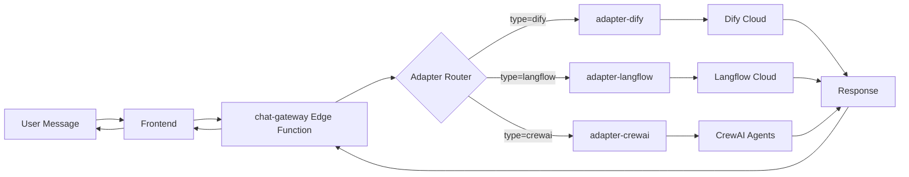

# Plano de Ação e Roadmap 2025
## Skyvidya Agent SDK - Implementação Detalhada

**Versão**: 1.0  
**Data**: 30 de Setembro de 2025  
**Última Atualização**: 30/09/2025

---

## 📋 Índice

1. [Status Atual](#1-status-atual)
2. [Objetivos Estratégicos 2025](#2-objetivos-estratégicos-2025)
3. [Fases de Implementação](#3-fases-de-implementação)
4. [Guia de Integração com Agentes Externos](#4-guia-de-integração-com-agentes-externos)
5. [Timeline e Recursos](#5-timeline-e-recursos)
6. [Checklist de Implementação](#6-checklist-de-implementação)
7. [Próximos Passos](#7-próximos-passos)

---

## 1. Status Atual

### 1.1 Conquistas Alcançadas por Pilar

#### 🎛️ Pilar 1: Orquestra e Gerencia - **60% Completo**

✅ **Implementado**:
- Lovable Cloud ativado (PostgreSQL, Auth, Storage, Edge Functions)
- Autenticação Google OAuth (Production-ready desde Set/2025)
- Schema base de dados (tenants, agents, conversations, messages)
- Row-Level Security (RLS) policies básicas

⏳ **Em Progresso**:
- Admin Dashboard (UI básica criada, faltam métricas)
- Gestão completa de agentes (CRUD básico OK, falta health checks)

❌ **Pendente**:
- Multi-tenant user management (associação usuário-múltiplos tenants)
- Tenant switcher component
- Gestão de roles e permissões granulares

#### 🔗 Pilar 2: Conecta e Integra - **20% Completo**

✅ **Implementado**:
- Arquitetura de adapters definida (interface TypeScript)

⏳ **Em Progresso**:
- Adapter Dify (estrutura criada, falta mapeamento de sessões)

❌ **Pendente**:
- Adapter Langflow (não iniciado)
- Adapter CrewAI (não iniciado)
- Gateway unificado de mensagens
- Fault tolerance (retry policies, circuit breakers)
- Fallback para Lovable AI

#### 📊 Pilar 3: Monitora e Observa - **15% Completo**

✅ **Implementado**:
- Tabelas de logs e metrics no banco

❌ **Pendente**:
- Structured logging (schema definido, não implementado)
- Dashboard de métricas em tempo real
- Alertas automáticos
- Cost tracking por tenant
- Performance monitoring (latência, throughput)

#### ✅ Pilar 4: Valida e Governa - **10% Completo**

✅ **Implementado**:
- RLS policies básicas

❌ **Pendente**:
- Quality Assurance suite (factuality, safety checks)
- Audit logs imutáveis
- Compliance templates (GDPR, HIPAA, SOX)
- A/B testing framework

#### 🚀 Pilar 5: Serve e Entrega - **25% Completo**

✅ **Implementado**:
- Landing page com os 5 pilares
- Componentes UI base (shadcn/ui)

⏳ **Em Progresso**:
- White-label framework (schema criado, falta aplicação dinâmica)

❌ **Pendente**:
- Domain-based routing
- Tenant branding customization UI
- APIs dedicadas por tenant
- Multi-channel delivery (WhatsApp, Slack)

### 1.2 Completude Geral

```
Overall Progress: ███░░░░░░░ 26%

Pilar 1 (Orquestra): ██████░░░░ 60%
Pilar 2 (Conecta):   ██░░░░░░░░ 20%
Pilar 3 (Monitora):  █░░░░░░░░░ 15%
Pilar 4 (Valida):    █░░░░░░░░░ 10%
Pilar 5 (Serve):     ██░░░░░░░░ 25%
```

---

## 2. Objetivos Estratégicos 2025

### 2.1 Q1 2025: Fundações Multi-Tenant

**OKR Principal**: Estabelecer arquitetura multi-tenant production-ready

**Key Results**:
- KR1: 3 tenants piloto ativos (Porto Alegre: Saúde, Educação, Meio Ambiente)
- KR2: 100% de isolamento de dados validado por auditoria de segurança
- KR3: SLA de 99% de uptime
- KR4: <1s de latência P95 para operações de chat

**Iniciativas Prioritárias**:

1. **Arquitetura Multi-Tenant Completa**
   - Implementar tenant switcher component
   - Multi-tenant user management (usuário pode pertencer a N tenants)
   - Validação dupla (email + user_id) em todas as RLS policies
   - Testes de penetração para validar isolamento

2. **White-Label Framework**
   - UI para customização de branding (logo, cores, fontes)
   - Aplicação dinâmica de CSS variables por tenant
   - Upload de assets (logo, favicon)
   - Preview em tempo real

3. **Domain Routing**
   - Middleware de detecção de tenant por domínio
   - Configuração de DNS e SSL automático
   - Fallback para subdomínio padrão

4. **Tenant Management Dashboard**
   - CRUD completo de tenants
   - Visualização de métricas por tenant
   - Gestão de usuários e permissões
   - Billing e usage tracking

### 2.2 Q2 2025: Escalabilidade e Performance

**OKR Principal**: Suportar 10+ tenants com alta carga

**Key Results**:
- KR1: 10 tenants ativos
- KR2: 10,000 conversações/dia processadas
- KR3: Latência P95 <500ms
- KR4: Zero downtime deployments

**Iniciativas**:

1. **Adapters Completos**
   - Finalizar Dify adapter (sessões, streaming)
   - Implementar Langflow adapter
   - Implementar CrewAI adapter
   - Gateway unificado com load balancing

2. **Observabilidade Completa**
   - Structured logging em todas as edge functions
   - Dashboard de métricas em tempo real
   - Alertas automáticos (email, Slack)
   - Cost tracking por tenant e modelo

3. **Performance Optimization**
   - Query optimization (indexes, materialized views)
   - Edge caching de respostas frequentes
   - Connection pooling
   - Async processing de tarefas pesadas

### 2.3 Q3 2025: Inteligência e Automação

**OKR Principal**: Reduzir time-to-value para novos tenants

**Key Results**:
- KR1: Onboarding de novo tenant em <4h (vs. 3 dias atual)
- KR2: Self-service tenant creation
- KR3: 80% de respostas de agentes validadas automaticamente
- KR4: CSAT médio >4.5/5.0

**Iniciativas**:

1. **Lovable AI Integration**
   - Integração completa com AI Gateway
   - Fallback automático quando adapter falha
   - Modelo de custo otimizado (gemini-flash para tasks simples)

2. **Quality Assurance Suite**
   - Validação automática (factuality, safety, relevance)
   - Hallucination detection
   - Response improvement suggestions

3. **Self-Service Onboarding**
   - Wizard de criação de tenant
   - Templates pré-configurados por setor
   - Documentação interativa

### 2.4 Q4 2025: Expansão e Go-to-Market

**OKR Principal**: Preparar para escala de 100+ tenants

**Key Results**:
- KR1: 50 tenants ativos
- KR2: 100,000 conversações/dia
- KR3: SOC 2 Type II certification iniciada
- KR4: ARR de $500k

**Iniciativas**:

1. **Marketplace de Agentes**
   - Catálogo público de agentes pré-configurados
   - One-click deployment
   - Revenue sharing com criadores

2. **Enterprise Features**
   - SSO (SAML, OIDC)
   - Advanced RBAC
   - Data residency options
   - SLA customizados

3. **Multi-Region Deployment**
   - Deploy em US, EU, BR
   - Data sovereignty compliance
   - Global load balancing

---

## 3. Fases de Implementação

### Fase 1: Setup Base ✅ (Semanas 1-2) - CONCLUÍDO

**Objetivo**: Infraestrutura básica pronta

**Tarefas**:
- [x] Criar projeto no Lovable
- [x] Ativar Lovable Cloud
- [x] Configurar repositório Git
- [x] Setup inicial do Vite + React + TypeScript
- [x] Instalar shadcn/ui components

**Entregas**:
- Projeto criado e versionado
- Dev environment funcional
- UI components base

---

### Fase 2: Autenticação e Estrutura Multi-Tenant (Semanas 3-5)

**Objetivo**: Usuários podem autenticar e acessar múltiplos tenants

#### Semana 3: Autenticação

**Tarefas**:
1. **Configurar Google OAuth**
   ```bash
   # No Lovable Cloud Dashboard
   1. Acessar Users -> Auth Settings -> Google
   2. Criar projeto no Google Cloud Console
   3. Habilitar Google+ API
   4. Criar credenciais OAuth 2.0
   5. Adicionar redirect URI: https://<project-id>.supabase.co/auth/v1/callback
   6. Copiar Client ID e Secret para Lovable
   ```

2. **Criar páginas de autenticação**
   ```typescript
   // src/pages/Login.tsx
   - Botão "Login with Google"
   - Formulário email/senha (opcional)
   - Redirect após login
   
   // src/pages/AuthCallback.tsx
   - Processar callback do Google
   - Criar/atualizar usuário
   - Redirect para dashboard
   ```

3. **Protected routes**
   ```typescript
   // src/components/ProtectedRoute.tsx
   - Verificar se usuário está autenticado
   - Redirect para /login se não
   ```

**Entregas**:
- [ ] Login com Google funcional
- [ ] Protected routes implementadas
- [ ] Session management

#### Semana 4: Schema Multi-Tenant

**Tarefas**:
1. **Migration: Criar tabelas core**
   ```sql
   -- Executar via Lovable migration tool
   
   CREATE TABLE tenants (
     id uuid PRIMARY KEY DEFAULT gen_random_uuid(),
     name text NOT NULL,
     slug text UNIQUE NOT NULL,
     status text DEFAULT 'active',
     created_at timestamptz DEFAULT now()
   );
   
   CREATE TABLE tenant_users (
     id uuid PRIMARY KEY DEFAULT gen_random_uuid(),
     tenant_id uuid REFERENCES tenants(id) ON DELETE CASCADE,
     user_id uuid NOT NULL,
     role text DEFAULT 'member',
     created_at timestamptz DEFAULT now(),
     UNIQUE(tenant_id, user_id)
   );
   
   CREATE TABLE agents (
     id uuid PRIMARY KEY DEFAULT gen_random_uuid(),
     tenant_id uuid REFERENCES tenants(id) ON DELETE CASCADE,
     name text NOT NULL,
     type text NOT NULL,
     config jsonb DEFAULT '{}',
     status text DEFAULT 'active',
     created_at timestamptz DEFAULT now()
   );
   
   CREATE TABLE conversations (
     id uuid PRIMARY KEY DEFAULT gen_random_uuid(),
     tenant_id uuid REFERENCES tenants(id) ON DELETE CASCADE,
     agent_id uuid REFERENCES agents(id),
     user_id uuid NOT NULL,
     title text,
     created_at timestamptz DEFAULT now()
   );
   
   CREATE TABLE messages (
     id uuid PRIMARY KEY DEFAULT gen_random_uuid(),
     conversation_id uuid REFERENCES conversations(id) ON DELETE CASCADE,
     role text NOT NULL,
     content text NOT NULL,
     metadata jsonb DEFAULT '{}',
     created_at timestamptz DEFAULT now()
   );
   ```

2. **RLS Policies**
   ```sql
   -- Habilitar RLS
   ALTER TABLE tenants ENABLE ROW LEVEL SECURITY;
   ALTER TABLE tenant_users ENABLE ROW LEVEL SECURITY;
   ALTER TABLE agents ENABLE ROW LEVEL SECURITY;
   ALTER TABLE conversations ENABLE ROW LEVEL SECURITY;
   ALTER TABLE messages ENABLE ROW LEVEL SECURITY;
   
   -- Policy: Isolamento por tenant
   CREATE POLICY "Users access only their tenants"
   ON tenant_users FOR ALL
   USING (user_id = auth.uid());
   
   CREATE POLICY "Tenant data isolation"
   ON agents FOR ALL
   USING (
     tenant_id IN (
       SELECT tenant_id FROM tenant_users WHERE user_id = auth.uid()
     )
   );
   
   -- Replicar para conversations, messages
   ```

**Entregas**:
- [ ] Schema completo do banco
- [ ] RLS policies ativas
- [ ] Testes de isolamento

#### Semana 5: Tenant Switcher

**Tarefas**:
1. **Hook useTenant**
   ```typescript
   // src/hooks/useTenant.ts
   export const useTenant = () => {
     const [currentTenantId, setCurrentTenantId] = useLocalStorage('tenant_id');
     
     const { data: tenants } = useQuery({
       queryKey: ['user-tenants', userId],
       queryFn: async () => {
         const { data } = await supabase
           .from('tenant_users')
           .select('tenants(*)')
           .eq('user_id', userId);
         return data;
       }
     });
     
     return { currentTenant, tenants, switchTenant: setCurrentTenantId };
   };
   ```

2. **TenantSwitcher Component**
   ```typescript
   // src/components/TenantSwitcher.tsx
   - Dropdown com lista de tenants do usuário
   - Ícone/nome do tenant atual
   - Troca de contexto ao selecionar
   ```

**Entregas**:
- [ ] TenantSwitcher funcionando
- [ ] Contexto global de tenant
- [ ] Persistência da seleção

---

### Fase 3: Funcionalidades Core (Semanas 6-9)

#### Semana 6: CRUD de Agentes

**Tarefas**:
1. **AgentList Component**
   ```typescript
   // src/components/agents/AgentList.tsx
   - Listar agentes do tenant
   - Filtros por status, tipo
   - Ordenação
   ```

2. **AgentForm Component**
   ```typescript
   // src/components/agents/AgentForm.tsx
   - Formulário criar/editar
   - Campos: name, type (select), description
   - Config específica por tipo (JSON editor)
   ```

3. **Mutations**
   ```typescript
   const createAgent = useMutation({
     mutationFn: async (agent) => {
       const { data } = await supabase
         .from('agents')
         .insert({ ...agent, tenant_id: currentTenant.id })
         .select()
         .single();
       return data;
     }
   });
   ```

**Entregas**:
- [ ] CRUD completo de agentes
- [ ] Validações de formulário
- [ ] Toast notifications

#### Semana 7: Interface de Chat

**Tarefas**:
1. **ChatInterface Component**
   ```typescript
   // src/components/chat/ChatInterface.tsx
   - Layout: sidebar (conversas) + área de mensagens
   - Input de mensagem com envio
   - Exibição de mensagens (user vs assistant)
   - Scroll automático para nova mensagem
   ```

2. **Message Component**
   ```typescript
   // src/components/chat/Message.tsx
   - Avatar (user ou agente)
   - Conteúdo com markdown rendering
   - Timestamp
   - Metadata (tokens, latência)
   ```

3. **Hook useChat**
   ```typescript
   // src/hooks/useChat.ts
   const sendMessage = useMutation({
     mutationFn: async ({ conversationId, message }) => {
       // 1. Salvar mensagem do usuário
       await supabase.from('messages').insert({
         conversation_id: conversationId,
         role: 'user',
         content: message
       });
       
       // 2. Chamar edge function chat-gateway
       const response = await supabase.functions.invoke('chat-gateway', {
         body: { conversationId, message }
       });
       
       return response;
     }
   });
   ```

**Entregas**:
- [ ] Chat funcional (envio/recebimento)
- [ ] Markdown rendering
- [ ] Loading states

#### Semanas 8-9: Edge Function - chat-gateway

**Tarefas**:
1. **Criar function**
   ```bash
   # Via Lovable: criar edge function "chat-gateway"
   ```

2. **Implementar lógica**
   ```typescript
   // supabase/functions/chat-gateway/index.ts
   import { serve } from 'https://deno.land/std@0.168.0/http/server.ts';
   import { createClient } from 'https://esm.sh/@supabase/supabase-js@2';
   
   serve(async (req) => {
     const { conversationId, message } = await req.json();
     
     const supabase = createClient(
       Deno.env.get('SUPABASE_URL')!,
       Deno.env.get('SUPABASE_SERVICE_ROLE_KEY')!
     );
     
     // 1. Buscar conversation e agent
     const { data: conversation } = await supabase
       .from('conversations')
       .select('*, agents(*)')
       .eq('id', conversationId)
       .single();
     
     // 2. Rotear para adapter correto
     const agent = conversation.agents;
     let response;
     
     if (agent.type === 'dify') {
       response = await callDifyAdapter(agent.config, message, conversationId);
     } else if (agent.type === 'lovable-ai') {
       response = await callLovableAI(message);
     }
     
     // 3. Salvar resposta
     await supabase.from('messages').insert({
       conversation_id: conversationId,
       role: 'assistant',
       content: response.text,
       metadata: { tokens: response.usage }
     });
     
     return new Response(JSON.stringify({ response }), {
       headers: { 'Content-Type': 'application/json' }
     });
   });
   ```

3. **Implementar callLovableAI**
   ```typescript
   const callLovableAI = async (message: string) => {
     const response = await fetch('https://ai.gateway.lovable.dev/v1/chat/completions', {
       method: 'POST',
       headers: {
         'Authorization': `Bearer ${Deno.env.get('LOVABLE_API_KEY')}`,
         'Content-Type': 'application/json'
       },
       body: JSON.stringify({
         model: 'google/gemini-2.5-flash',
         messages: [
           { role: 'system', content: 'Você é um assistente prestativo.' },
           { role: 'user', content: message }
         ]
       })
     });
     
     return await response.json();
   };
   ```

**Entregas**:
- [ ] chat-gateway funcional
- [ ] Lovable AI integrado (fallback)
- [ ] Logs estruturados

---

### Fase 4: Admin Dashboard (Semanas 10-12)

#### Semana 10: Layout e Navegação

**Tarefas**:
1. **AdminLayout Component**
   ```typescript
   // src/components/admin/AdminLayout.tsx
   - Sidebar com navegação
   - Header com breadcrumbs
   - Seções: Tenants, Users, Agents, Metrics, Logs
   ```

2. **RBAC Check**
   ```typescript
   // src/hooks/useIsAdmin.ts
   export const useIsAdmin = () => {
     const { data: role } = useQuery({
       queryKey: ['user-role', userId, tenantId],
       queryFn: async () => {
         const { data } = await supabase
           .from('tenant_users')
           .select('role')
           .eq('user_id', userId)
           .eq('tenant_id', tenantId)
           .single();
         return data?.role;
       }
     });
     
     return role === 'admin' || role === 'owner';
   };
   ```

**Entregas**:
- [ ] Layout admin criado
- [ ] Navegação funcional
- [ ] Proteção de rotas (apenas admins)

#### Semanas 11-12: Dashboards

**Tarefas**:
1. **Tenant Management**
   ```typescript
   // src/pages/admin/Tenants.tsx
   - Tabela de tenants
   - CRUD (create, pause, delete)
   - Visualizar métricas por tenant
   ```

2. **User Management**
   ```typescript
   // src/pages/admin/Users.tsx
   - Tabela de usuários do tenant
   - Convidar novos usuários (email)
   - Gerenciar roles
   - Remover usuários
   ```

3. **Metrics Dashboard**
   ```typescript
   // src/pages/admin/Metrics.tsx
   - Cards: Total Conversations, Active Agents, Avg Latency
   - Gráficos: Conversas por dia (line chart)
   - Tabela: Top agentes por uso
   ```

**Entregas**:
- [ ] Tenant management funcional
- [ ] User management funcional
- [ ] Dashboard de métricas

---

### Fase 5: QA e Observabilidade (Semanas 13-14)

#### Semana 13: Logging Estruturado

**Tarefas**:
1. **Logger Utility**
   ```typescript
   // supabase/functions/_shared/logger.ts
   export const createLogger = (context: { tenant_id?: string; trace_id: string }) => ({
     info: (message: string, metadata?: any) => {
       console.log(JSON.stringify({
         level: 'info',
         timestamp: new Date().toISOString(),
         ...context,
         message,
         metadata
       }));
     },
     error: (message: string, error: Error, metadata?: any) => {
       console.error(JSON.stringify({
         level: 'error',
         timestamp: new Date().toISOString(),
         ...context,
         message,
         error: error.message,
         stack: error.stack,
         metadata
       }));
     }
   });
   ```

2. **Aplicar em todas as edge functions**

**Entregas**:
- [ ] Logger utility criado
- [ ] Logs estruturados em todas as functions
- [ ] Dashboard de logs (via Lovable Cloud)

#### Semana 14: Métricas e Alertas

**Tarefas**:
1. **Coletar métricas**
   ```typescript
   // Após cada interação, salvar métrica
   await supabase.from('metrics').insert({
     tenant_id,
     agent_id,
     metric_name: 'response_time',
     metric_value: latency,
     unit: 'ms',
     recorded_at: new Date().toISOString()
   });
   ```

2. **Criar triggers de alerta**
   ```sql
   CREATE OR REPLACE FUNCTION check_high_error_rate()
   RETURNS TRIGGER AS $$
   DECLARE
     error_count int;
   BEGIN
     SELECT COUNT(*) INTO error_count
     FROM logs
     WHERE tenant_id = NEW.tenant_id
       AND level = 'error'
       AND created_at > now() - interval '5 minutes';
     
     IF error_count > 10 THEN
       INSERT INTO alerts (tenant_id, severity, type, message)
       VALUES (NEW.tenant_id, 'critical', 'high_error_rate', 
               'More than 10 errors in last 5 minutes');
     END IF;
     
     RETURN NEW;
   END;
   $$ LANGUAGE plpgsql;
   ```

**Entregas**:
- [ ] Métricas coletadas automaticamente
- [ ] Alertas configurados
- [ ] Notificações (email/toast)

---

### Fase 6: Integração com Agentes Externos (Semanas 15-17)

#### Semanas 15-16: Dify Adapter Completo

**Tarefas**:
1. **Criar edge function**
   ```typescript
   // supabase/functions/adapter-dify/index.ts
   export const callDify = async (config: DifyConfig, message: string, sessionId: string) => {
     const response = await fetch(`${config.api_url}/chat-messages`, {
       method: 'POST',
       headers: {
         'Authorization': `Bearer ${config.api_key}`,
         'Content-Type': 'application/json'
       },
       body: JSON.stringify({
         inputs: {},
         query: message,
         response_mode: 'blocking', // ou 'streaming'
         conversation_id: sessionId,
         user: 'user-' + sessionId
       })
     });
     
     const data = await response.json();
     
     return {
       text: data.answer,
       usage: {
         prompt_tokens: data.metadata.usage.prompt_tokens,
         completion_tokens: data.metadata.usage.completion_tokens,
         total_tokens: data.metadata.usage.total_tokens
       },
       conversation_id: data.conversation_id
     };
   };
   ```

2. **Mapeamento de sessões**
   ```sql
   -- Tabela para mapear conversation_id interno com conversation_id do Dify
   CREATE TABLE external_sessions (
     id uuid PRIMARY KEY DEFAULT gen_random_uuid(),
     conversation_id uuid REFERENCES conversations(id),
     agent_id uuid REFERENCES agents(id),
     external_session_id text NOT NULL,
     platform text NOT NULL, -- 'dify', 'langflow', 'crewai'
     created_at timestamptz DEFAULT now()
   );
   ```

**Entregas**:
- [ ] Dify adapter funcional
- [ ] Mapeamento de sessões
- [ ] Testes com Dify Cloud

#### Semana 17: Langflow Adapter

**Tarefas**:
1. **Implementar adapter**
   ```typescript
   // supabase/functions/adapter-langflow/index.ts
   export const callLangflow = async (config: LangflowConfig, message: string, sessionId: string) => {
     const response = await fetch(`${config.api_url}/api/v1/run/${config.flow_id}`, {
       method: 'POST',
       headers: {
         'x-api-key': config.api_key,
         'Content-Type': 'application/json'
       },
       body: JSON.stringify({
         input_value: message,
         output_type: 'chat',
         input_type: 'chat',
         tweaks: {
           'ChatInput-xxxxx': {
             session_id: sessionId
           }
         }
       })
     });
     
     const data = await response.json();
     
     return {
       text: data.outputs[0].outputs[0].results.message.text,
       usage: {} // Langflow não retorna usage
     };
   };
   ```

**Entregas**:
- [ ] Langflow adapter funcional
- [ ] Documentação de integração
- [ ] Exemplo de flow no Langflow

---

### Fase 7: White-Label e Multi-Tenant Avançado (Semanas 18-21)

#### Semana 18: Branding Customization

**Tarefas**:
1. **Schema de branding**
   ```sql
   CREATE TABLE tenant_branding (
     id uuid PRIMARY KEY DEFAULT gen_random_uuid(),
     tenant_id uuid REFERENCES tenants(id) UNIQUE,
     logo_url text,
     primary_color text DEFAULT '210 100% 50%',
     secondary_color text DEFAULT '220 90% 60%',
     font_family text DEFAULT 'Inter',
     custom_css text,
     created_at timestamptz DEFAULT now()
   );
   ```

2. **BrandingForm Component**
   ```typescript
   // src/pages/admin/Branding.tsx
   - Upload de logo
   - Color pickers (HSL)
   - Font selector
   - Custom CSS editor
   - Preview em tempo real
   ```

3. **Hook useBranding**
   ```typescript
   export const useBranding = () => {
     const { data: branding } = useQuery({
       queryKey: ['tenant-branding', tenantId],
       queryFn: async () => {
         const { data } = await supabase
           .from('tenant_branding')
           .select('*')
           .eq('tenant_id', tenantId)
           .single();
         return data;
       }
     });
     
     useEffect(() => {
       if (!branding) return;
       
       document.documentElement.style.setProperty('--primary', branding.primary_color);
       document.documentElement.style.setProperty('--secondary', branding.secondary_color);
       
       const link = document.querySelector('link[rel="icon"]');
       if (link && branding.logo_url) {
         link.setAttribute('href', branding.logo_url);
       }
     }, [branding]);
   };
   ```

**Entregas**:
- [ ] UI de customização de branding
- [ ] Aplicação dinâmica de estilos
- [ ] Upload de assets para Storage

#### Semanas 19-20: Domain Routing

**Tarefas**:
1. **Schema de domínios**
   ```sql
   CREATE TABLE tenant_domains (
     id uuid PRIMARY KEY DEFAULT gen_random_uuid(),
     tenant_id uuid REFERENCES tenants(id),
     domain text UNIQUE NOT NULL,
     is_primary boolean DEFAULT false,
     is_active boolean DEFAULT true,
     verified_at timestamptz,
     created_at timestamptz DEFAULT now()
   );
   ```

2. **Middleware de detecção**
   ```typescript
   // src/lib/detectTenant.ts
   export const detectTenantFromDomain = async () => {
     const hostname = window.location.hostname;
     
     const { data: tenantDomain } = await supabase
       .from('tenant_domains')
       .select('tenant_id, tenants(*)')
       .eq('domain', hostname)
       .eq('is_active', true)
       .single();
     
     if (tenantDomain) {
       return tenantDomain.tenants;
     }
     
     // Fallback: extrair de subdomain
     const subdomain = hostname.split('.')[0];
     const { data: tenant } = await supabase
       .from('tenants')
       .select('*')
       .eq('slug', subdomain)
       .single();
     
     return tenant;
   };
   ```

3. **Configuração DNS**
   ```
   # Instruir usuários a configurar DNS
   Type: CNAME
   Name: cliente.suaempresa.com
   Value: <project-id>.supabase.co
   ```

**Entregas**:
- [ ] Domain detection funcional
- [ ] UI para adicionar domínios customizados
- [ ] Documentação de configuração DNS

#### Semana 21: Testes End-to-End

**Tarefas**:
1. **Criar 3 tenants de teste**
   ```sql
   INSERT INTO tenants (name, slug) VALUES
     ('Tenant A', 'tenant-a'),
     ('Tenant B', 'tenant-b'),
     ('Tenant C', 'tenant-c');
   ```

2. **Testar isolamento**
   - Logar como usuário de Tenant A
   - Verificar que não vê dados de Tenant B
   - Tentar acessar URLs diretas de recursos de Tenant C (deve falhar)

3. **Testar white-label**
   - Configurar branding diferente para cada tenant
   - Acessar via domínios customizados
   - Validar que CSS/logo corretos são aplicados

**Entregas**:
- [ ] Testes de isolamento passando
- [ ] White-label funcionando em produção
- [ ] Documentação de testes

---

## 4. Guia de Integração com Agentes Externos

### 4.1 Arquitetura do Gateway



### 4.2 Tutorial: Integrar Dify

#### Passo 1: Criar App no Dify

1. Acesse [Dify Cloud](https://cloud.dify.ai)
2. Crie novo app (tipo: Chatbot)
3. Configure o prompt e modelo
4. Publique o app
5. Copie a **API Key** (Ex: `app-xxxxxxxxxxxxxxxxxxxxxx`)

#### Passo 2: Criar Agente na SDK

```typescript
const { data: agent } = await supabase
  .from('agents')
  .insert({
    tenant_id: currentTenant.id,
    name: 'Assistente Dify',
    type: 'dify',
    config: {
      api_key: 'app-xxxxxxxxxxxxxxxxxxxxxx',
      api_url: 'https://api.dify.ai/v1',
      model: 'gpt-4'
    }
  })
  .select()
  .single();
```

#### Passo 3: Testar Integração

```typescript
// Iniciar conversação
const { data: conversation } = await supabase
  .from('conversations')
  .insert({
    tenant_id: currentTenant.id,
    agent_id: agent.id,
    user_id: currentUser.id,
    title: 'Teste Dify'
  })
  .select()
  .single();

// Enviar mensagem
const response = await supabase.functions.invoke('chat-gateway', {
  body: {
    conversationId: conversation.id,
    message: 'Olá, como você pode me ajudar?'
  }
});

console.log('Resposta:', response.data);
```

#### Passo 4: Mapeamento de Sessões

O Dify usa `conversation_id` próprio. A SDK gerencia o mapeamento:

```typescript
// adapter-dify/index.ts

// 1ª mensagem: criar nova conversation no Dify
const firstResponse = await callDify(config, message, null);

// Salvar mapeamento
await supabase.from('external_sessions').insert({
  conversation_id: internalConversationId,
  agent_id: agent.id,
  external_session_id: firstResponse.conversation_id,
  platform: 'dify'
});

// Mensagens subsequentes: usar conversation_id mapeado
const { data: session } = await supabase
  .from('external_sessions')
  .select('external_session_id')
  .eq('conversation_id', internalConversationId)
  .single();

const response = await callDify(config, message, session.external_session_id);
```

### 4.3 Tutorial: Integrar Langflow

#### Passo 1: Criar Flow no Langflow

1. Acesse [Langflow](https://www.langflow.org/)
2. Crie novo flow
3. Adicione componente **ChatInput** (copie o ID)
4. Configure LLM e ChatOutput
5. Salve e obtenha **Flow ID** (UUID)
6. Gere API Key em Settings

#### Passo 2: Criar Agente

```typescript
const { data: agent } = await supabase
  .from('agents')
  .insert({
    tenant_id: currentTenant.id,
    name: 'Assistente Langflow',
    type: 'langflow',
    config: {
      api_key: 'sk-xxxxxxxxxxxxxxxxxxxxxx',
      api_url: 'https://api.langflow.astra.datastax.com',
      flow_id: '12345678-1234-1234-1234-123456789abc',
      chat_input_id: 'ChatInput-xxxxx' // ID do componente ChatInput
    }
  })
  .select()
  .single();
```

#### Passo 3: Implementar Adapter

```typescript
// adapter-langflow/index.ts
export const callLangflow = async (config, message, sessionId) => {
  const response = await fetch(`${config.api_url}/api/v1/run/${config.flow_id}`, {
    method: 'POST',
    headers: {
      'x-api-key': config.api_key,
      'Content-Type': 'application/json'
    },
    body: JSON.stringify({
      input_value: message,
      output_type: 'chat',
      input_type: 'chat',
      tweaks: {
        [config.chat_input_id]: {
          session_id: sessionId || crypto.randomUUID()
        }
      }
    })
  });
  
  const data = await response.json();
  const output = data.outputs[0].outputs[0].results.message;
  
  return {
    text: output.text,
    session_id: sessionId || output.session_id
  };
};
```

### 4.4 Tutorial: Integrar CrewAI

#### Passo 1: Criar Crew

```python
# crew_config.py (no seu servidor CrewAI)
from crewai import Agent, Task, Crew

support_agent = Agent(
    role='Customer Support',
    goal='Help users with their questions',
    backstory='You are a helpful assistant',
    llm='gpt-4'
)

task = Task(
    description='{query}',
    expected_output='A helpful response',
    agent=support_agent
)

crew = Crew(
    agents=[support_agent],
    tasks=[task],
    verbose=True
)
```

#### Passo 2: Expor API

```python
# api.py
from fastapi import FastAPI
from pydantic import BaseModel

app = FastAPI()

class CrewInput(BaseModel):
    query: str
    session_id: str

@app.post('/kickoff')
async def kickoff_crew(input: CrewInput):
    result = crew.kickoff(inputs={'query': input.query})
    return {
        'response': result,
        'session_id': input.session_id
    }
```

#### Passo 3: Criar Agente na SDK

```typescript
const { data: agent } = await supabase
  .from('agents')
  .insert({
    tenant_id: currentTenant.id,
    name: 'Assistente CrewAI',
    type: 'crewai',
    config: {
      api_key: 'your-crew-api-key',
      crew_endpoint: 'https://seu-servidor.com/kickoff'
    }
  })
  .select()
  .single();
```

#### Passo 4: Implementar Adapter

```typescript
// adapter-crewai/index.ts
export const callCrewAI = async (config, message, sessionId) => {
  const response = await fetch(config.crew_endpoint, {
    method: 'POST',
    headers: {
      'Authorization': `Bearer ${config.api_key}`,
      'Content-Type': 'application/json'
    },
    body: JSON.stringify({
      query: message,
      session_id: sessionId || crypto.randomUUID()
    })
  });
  
  const data = await response.json();
  
  return {
    text: data.response,
    session_id: data.session_id
  };
};
```

### 4.5 Troubleshooting

#### Problema: "Agent not responding"

**Causas**:
1. API Key inválida
2. Endpoint incorreto
3. Timeout na conexão

**Solução**:
```typescript
// Adicionar retry logic
const callWithRetry = async (fn, retries = 3) => {
  for (let i = 0; i < retries; i++) {
    try {
      return await fn();
    } catch (error) {
      if (i === retries - 1) throw error;
      await new Promise(r => setTimeout(r, 1000 * (i + 1)));
    }
  }
};

const response = await callWithRetry(() => callDify(config, message, sessionId));
```

#### Problema: "Session not persisting"

**Causa**: Mapeamento de `external_session_id` não salvo

**Solução**:
```typescript
// Verificar se session existe
const { data: existingSession } = await supabase
  .from('external_sessions')
  .select('external_session_id')
  .eq('conversation_id', conversationId)
  .maybeSingle();

if (!existingSession) {
  // Primeira mensagem: salvar mapping
  await supabase.from('external_sessions').insert({
    conversation_id: conversationId,
    agent_id: agentId,
    external_session_id: response.conversation_id,
    platform: 'dify'
  });
}
```

---

## 5. Timeline e Recursos

### 5.1 Timeline Geral

```
Total: 15-22 semanas (3.5 - 5.5 meses)

Fase 1: Setup Base               ██ (2 semanas) ✅ CONCLUÍDO
Fase 2: Auth + Multi-Tenant      ███ (3 semanas)
Fase 3: Funcionalidades Core     ████ (4 semanas)
Fase 4: Admin Dashboard          ███ (3 semanas)
Fase 5: QA + Observabilidade     ██ (2 semanas)
Fase 6: Integração Agentes       ███ (3 semanas)
Fase 7: White-Label + Advanced   ████ (4 semanas)

Critical Path:
[Fase 1] -> [Fase 2] -> [Fase 3] -> [Fase 6]
```

### 5.2 Recursos Necessários

**Equipe Mínima**:
- 1 Full-stack Developer (React + PostgreSQL + Deno)
- 1 DevOps/Cloud Engineer (part-time, para DNS e deployment)
- 1 Product Designer (part-time, para UX do admin dashboard)

**Ferramentas**:
- Lovable.dev (desenvolvimento e hosting)
- Lovable Cloud (backend)
- GitHub (versionamento)
- Linear/Asana (project management)
- Figma (design)

**Custos Estimados** (mensal):
- Lovable Cloud: $0-50 (tier gratuito até 10k usuários)
- Domínios customizados: ~$12/domínio/ano
- Agentes externos:
  - Dify Cloud: $0-200 (depende de uso)
  - Langflow: $0-100
  - CrewAI: Self-hosted (grátis) ou cloud ($?)

### 5.3 Complexidade por Fase

| Fase | Complexidade | Riscos | Mitigação |
|------|--------------|--------|-----------|
| 1. Setup Base | 🟢 Baixa | Nenhum | - |
| 2. Auth + Multi-Tenant | 🟡 Média | RLS mal configurado | Testes de penetração |
| 3. Funcionalidades Core | 🟡 Média | UX ruim de chat | Feedback contínuo |
| 4. Admin Dashboard | 🟡 Média | Overengineering | MVP first |
| 5. QA + Observabilidade | 🟠 Média-Alta | Logs excessivos (custo) | Sampling |
| 6. Integração Agentes | 🔴 Alta | APIs instáveis | Adapters com retry + fallback |
| 7. White-Label + Advanced | 🟠 Média-Alta | DNS propagation lenta | Documentação clara |

---

## 6. Checklist de Implementação

### ✅ Setup Inicial
- [x] Criar projeto no Lovable
- [x] Ativar Lovable Cloud
- [x] Configurar Git
- [x] Instalar dependências base

### 🔐 Autenticação
- [ ] Configurar Google OAuth
- [ ] Criar páginas Login/Signup
- [ ] Protected routes
- [ ] Session management

### 🏢 Multi-Tenant
- [ ] Schema de banco (tenants, tenant_users, agents, conversations, messages)
- [ ] RLS policies completas
- [ ] TenantSwitcher component
- [ ] Validação dupla (email + user_id)
- [ ] Testes de isolamento

### 🤖 Agentes
- [ ] CRUD de agentes
- [ ] Configuração por tipo (dify, langflow, crewai)
- [ ] Health checks
- [ ] Testes de conexão

### 💬 Chat
- [ ] ChatInterface component
- [ ] Envio/recebimento de mensagens
- [ ] Histórico de conversações
- [ ] Markdown rendering
- [ ] Loading states

### ⚙️ Edge Functions
- [ ] chat-gateway (roteamento)
- [ ] adapter-dify
- [ ] adapter-langflow
- [ ] adapter-crewai (opcional)
- [ ] validate-response (QA)
- [ ] Lovable AI fallback
- [ ] Structured logging

### 📊 Admin Dashboard
- [ ] Layout e navegação
- [ ] Tenant management
- [ ] User management (convidar, remover, roles)
- [ ] Agent management
- [ ] Metrics dashboard
- [ ] Logs viewer

### 🎨 White-Label
- [ ] Schema de branding
- [ ] UI de customização (logo, cores, fontes)
- [ ] Aplicação dinâmica de estilos
- [ ] Upload de assets para Storage
- [ ] Preview em tempo real

### 🌐 Domain Routing
- [ ] Schema de domínios
- [ ] Middleware de detecção
- [ ] UI para adicionar domínios
- [ ] Documentação DNS

### 📈 Observabilidade
- [ ] Structured logging em todas as functions
- [ ] Coleta de métricas (latency, tokens, errors)
- [ ] Dashboard de métricas em tempo real
- [ ] Alertas automáticos
- [ ] Cost tracking por tenant

### ✅ QA e Governança
- [ ] Quality Assurance suite (factuality, safety)
- [ ] Audit logs imutáveis
- [ ] Compliance templates (GDPR, HIPAA)
- [ ] Testes de segurança

### 🚀 Deployment
- [ ] Configurar domínio customizado principal
- [ ] SSL configurado
- [ ] Backup strategy
- [ ] Monitoring em produção

---

## 7. Próximos Passos

### Imediatos (Esta Semana)

1. **Finalizar Autenticação Google OAuth**
   - Verificar se está funcionando em produção
   - Testar fluxo completo (login -> callback -> dashboard)
   - Documentar setup para novos desenvolvedores

2. **Implementar TenantSwitcher**
   - Criar componente dropdown
   - Hook useTenant com React Query
   - Persistir seleção em localStorage
   - Adicionar no Header

3. **Criar Admin Dashboard Básico**
   - Layout com sidebar
   - Página de gestão de tenants (listar, criar)
   - Página de gestão de agentes (listar, criar)

### Curto Prazo (Próximas 2 Semanas)

1. **Edge Function: chat-gateway**
   - Implementar roteamento básico
   - Integrar Lovable AI como fallback
   - Testar end-to-end (frontend -> function -> resposta)

2. **ChatInterface Funcional**
   - UI de conversação
   - Envio de mensagens
   - Exibição de histórico
   - Loading e error states

3. **Dify Adapter**
   - Implementar função de chamada
   - Mapeamento de sessões
   - Teste com app real no Dify

### Médio Prazo (Próximo Mês)

1. **White-Label Framework**
   - UI de customização de branding
   - Aplicação dinâmica de CSS
   - Upload de logo

2. **Domain Routing**
   - Detecção de tenant por domínio
   - Documentação de configuração DNS

3. **Observabilidade Básica**
   - Logs estruturados
   - Dashboard de métricas
   - Alertas de erro

### Blockers Conhecidos

1. **Documentação de APIs externas incompleta**
   - Langflow: Docs de API não cobrem todos os casos de uso
   - **Mitigação**: Testes empíricos + suporte da comunidade

2. **Custos de modelos de IA**
   - Uncertainty sobre volume de uso
   - **Mitigação**: Implementar Lovable AI primeiro (tier gratuito), depois adicionar adapters

3. **Propagação de DNS lenta**
   - Domínios customizados podem levar 24-48h
   - **Mitigação**: Comunicar expectativa aos usuários

### Decisões Pendentes

1. **Modelo de Pricing**
   - Free tier: Até quantas conversações/mês?
   - Pro tier: Preço e recursos?
   - Enterprise: Custom pricing?

2. **Self-Service vs Assisted Onboarding**
   - Permitir signup direto ou apenas via convite?
   - Wizard de onboarding automático ou manual?

3. **Realtime vs Polling**
   - Usar WebSocket (Supabase Realtime) ou polling para chat?
   - Realtime é mais rápido mas consome mais recursos

---

## 📊 Métricas de Sucesso

### Semana 10 (Fim de Fase 4)
- [ ] 3 tenants piloto criados
- [ ] 50+ conversações completas
- [ ] SLA >98% de uptime
- [ ] Latência P95 <2s

### Semana 15 (Fim de Fase 6)
- [ ] 2 adapters funcionais (Dify + Langflow ou CrewAI)
- [ ] Fallback para Lovable AI testado
- [ ] Zero data leaks entre tenants (auditoria de segurança)

### Semana 21 (Fim de Fase 7)
- [ ] White-label funcionando com 2+ domínios customizados
- [ ] Self-service onboarding operacional
- [ ] Documentação completa publicada

---

**Documento mantido por**: Equipe Skyvidya  
**Última revisão**: 30 de Setembro de 2025  
**Próxima revisão**: Quinzenal (a cada Sprint)

---

## Apêndice A: Glossário

- **Tenant**: Organização/cliente que usa a plataforma (ex: Prefeitura de Porto Alegre)
- **Agent**: Instância de assistente IA configurada (ex: Assistente de Saúde)
- **Adapter**: Módulo que traduz protocolo da SDK para protocolo de plataforma externa (Dify, Langflow, etc.)
- **RLS**: Row-Level Security - isolamento de dados no banco de dados
- **White-Label**: Capacidade de personalizar branding (logo, cores, domínio)
- **Edge Function**: Função serverless executada no edge (Deno runtime no Supabase)
- **Lovable AI Gateway**: Serviço de IA da Lovable com múltiplos modelos disponíveis

## Apêndice B: Links Úteis

- [Lovable Docs](https://docs.lovable.dev/)
- [Supabase Docs](https://supabase.com/docs)
- [Dify Docs](https://docs.dify.ai/)
- [Langflow Docs](https://docs.langflow.org/)
- [CrewAI Docs](https://docs.crewai.com/)
- [shadcn/ui](https://ui.shadcn.com/)
- [Tailwind CSS](https://tailwindcss.com/docs)
