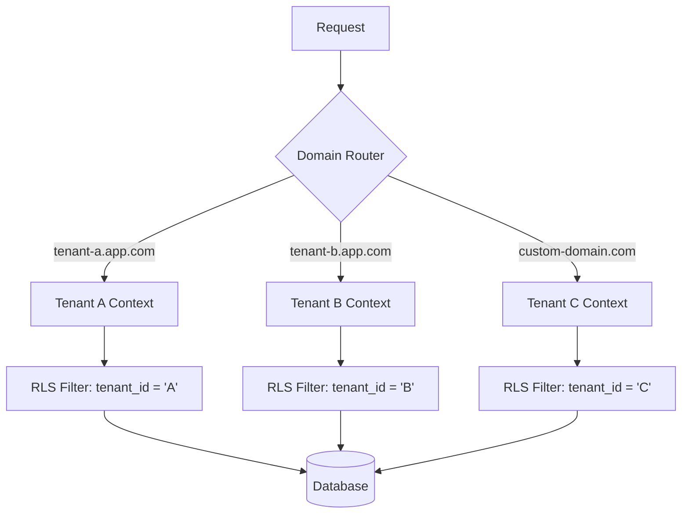
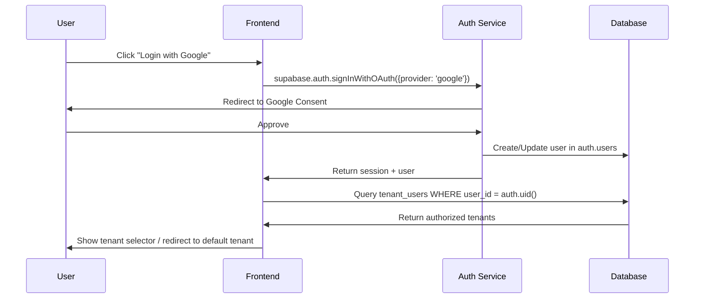
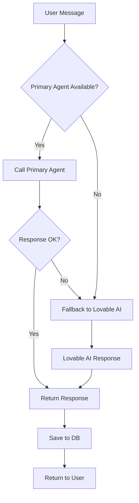

# Product Requirements Document v3.0
## Skyvidya Agent SDK - Plataforma Multi-Tenant de Orquestração de Agentes IA

**Versão**: 3.0  
**Data**: 30 de Setembro de 2025  
**Status**: Em Desenvolvimento  
**Proprietário do Produto**: Equipe Skyvidya

---

## 📋 Índice

1. [Visão Estratégica](#1-visão-estratégica)
2. [Conceito Multi-Tenant](#2-conceito-multi-tenant)
3. [Arquitetura Funcional](#3-arquitetura-funcional)
4. [Modelo de Dados](#4-modelo-de-dados)
5. [Edge Functions](#5-edge-functions)
6. [Integrações com IA](#6-integrações-com-ia)
7. [Segurança e Compliance](#7-segurança-e-compliance)
8. [Métricas e KPIs](#8-métricas-e-kpis)

---

## 1. Visão Estratégica

### 1.1 Objetivo Principal

Criar a **plataforma white-label líder de mercado** para orquestração de agentes de IA em arquiteturas multi-tenant, permitindo que organizações implementem assistentes inteligentes personalizados em semanas, não meses.

### 1.2 Posicionamento de Mercado

**Diferencial Competitivo**:
- ✅ **Multi-tenant nativo** (vs. single-tenant das soluções tradicionais)
- ✅ **Agnóstico de plataforma** (Dify, Langflow, CrewAI, n8n)
- ✅ **White-label completo** (domínios, branding, APIs dedicadas)
- ✅ **Compliance integrado** (GDPR, HIPAA, SOX, LGPD out-of-the-box)
- ✅ **Observabilidade total** (logs, métricas, custos em tempo real)

### 1.3 North Star Metric

**Métrica Primária**: Número de Conversações Ativas Multi-Tenant Gerenciadas por Mês

**Métricas Secundárias**:
- Tempo médio de onboarding de novo tenant (<24h)
- SLA de disponibilidade (>99.9%)
- Latência p95 (<500ms)
- CSAT médio por tenant (>4.5/5.0)

### 1.4 Público-Alvo

| Segmento | Perfil | Pain Points |
|----------|--------|-------------|
| **Governos** | Secretarias municipais/estaduais | Atendimento 24/7, múltiplas áreas, LGPD |
| **Saúde** | Hospitais, clínicas, telemedicina | HIPAA, triagem, agendamento |
| **Financeiro** | Bancos, fintechs, seguradoras | SOX, fraude, atendimento tier 1 |
| **Educação** | Universidades, escolas | Suporte acadêmico, matrículas |
| **Empresas** | Corporações multi-BU | Suporte interno, RH, TI |

---

## 2. Conceito Multi-Tenant

### 2.1 Definição Técnica

**Multi-tenancy** é a capacidade de uma única instância da aplicação servir múltiplos tenants (organizações) com:
- **Isolamento de dados**: Cada tenant acessa apenas seus próprios dados
- **Customização**: Branding, domínios e configurações únicas por tenant
- **Escalabilidade**: Recursos compartilhados com alocação dinâmica
- **Segurança**: Row-Level Security (RLS) + validações duplas

### 2.2 Princípios Norteadores

1. **Tenant-First Design**: Toda entidade do sistema pertence a um tenant
2. **Zero Trust**: Validação de tenant_id em todas as operações
3. **Isolation by Default**: RLS policies obrigatórias em todas as tabelas
4. **Auditability**: Logs imutáveis de todas as ações cross-tenant
5. **White-Label Native**: Tenant pode ser completamente rebrandizado
6. **Domain-Based Routing**: Roteamento automático baseado em domínio

### 2.3 Arquitetura de Isolamento



---

## 3. Arquitetura Funcional

### 3.1 Módulo 1: Orquestração e Gerenciamento

#### 3.1.1 Capacidades Core

**CA-001: Gestão de Tenants**
- **Descrição**: CRUD completo de tenants com configurações isoladas
- **User Story**: Como super-admin, quero criar e gerenciar múltiplos tenants para isolar organizações
- **Acceptance Criteria**:
  - [ ] Criar tenant com nome, slug único e configurações padrão
  - [ ] Atualizar branding (logo, cores, fontes)
  - [ ] Configurar domínios customizados
  - [ ] Suspender/reativar tenants
  - [ ] Excluir tenant com soft-delete (preserva auditoria)

**CA-002: Autenticação Multi-Tenant**
- **Descrição**: Sistema de autenticação com suporte a múltiplos providers
- **User Story**: Como usuário, quero fazer login com email ou Google e acessar apenas meus tenants autorizados
- **Acceptance Criteria**:
  - [ ] Login via email/senha (passwordless opcional)
  - [ ] Login via Google OAuth
  - [ ] Validação dupla: email + user_id
  - [ ] Multi-tenant user (usuário pode pertencer a vários tenants)
  - [ ] Session management com tenant_id no contexto

**Implementação de Segurança**:

```sql
-- Prevenção de escalação de privilégios
CREATE POLICY "Users can only access their tenants"
ON public.tenant_users
FOR ALL
USING (
  auth.uid() = user_id 
  AND 
  (SELECT email FROM auth.users WHERE id = auth.uid()) = 
  (SELECT email FROM auth.users WHERE id = user_id)
);
```

**CA-003: Gestão de Agentes**
- **Descrição**: Lifecycle management de agentes por tenant
- **User Story**: Como tenant-admin, quero criar agentes customizados conectados a diferentes plataformas (Dify, Langflow, CrewAI)
- **Acceptance Criteria**:
  - [ ] Criar agente com tipo (dify|langflow|crewai|custom)
  - [ ] Configurar credenciais e parâmetros específicos do adapter
  - [ ] Ativar/pausar agente
  - [ ] Testar conexão com plataforma externa
  - [ ] Visualizar métricas de uso (conversações, tokens, custos)

**CA-004: Gestão de Conversações**
- **Descrição**: Controle de sessões de chat entre usuários e agentes
- **User Story**: Como usuário, quero iniciar conversas com agentes e visualizar histórico
- **Acceptance Criteria**:
  - [ ] Iniciar conversação com agente selecionado
  - [ ] Enviar mensagens com streaming de respostas
  - [ ] Anexar arquivos (imagens, PDFs)
  - [ ] Visualizar histórico paginado
  - [ ] Buscar por palavras-chave no histórico
  - [ ] Exportar conversação (JSON, TXT)

#### 3.1.2 Fluxo de Autenticação



### 3.2 Módulo 2: Conexão e Integração

#### 3.2.1 Adapter Pattern

**Universal Agent Adapter Interface**:

```typescript
interface AgentAdapter {
  type: 'dify' | 'langflow' | 'crewai' | 'custom';
  
  // Lifecycle
  initialize(config: AdapterConfig): Promise<void>;
  healthCheck(): Promise<boolean>;
  
  // Messaging
  sendMessage(params: {
    message: string;
    session_id: string;
    user_id: string;
    metadata?: Record<string, any>;
  }): Promise<AgentResponse>;
  
  streamMessage(params: SendMessageParams): AsyncGenerator<StreamChunk>;
  
  // Session management
  createSession(user_id: string): Promise<string>;
  endSession(session_id: string): Promise<void>;
  
  // Observability
  getMetrics(): Promise<AdapterMetrics>;
}
```

#### 3.2.2 Implementações por Plataforma

**Dify Adapter** (`supabase/functions/adapters/dify.ts`):

```typescript
export class DifyAdapter implements AgentAdapter {
  async sendMessage({ message, session_id, user_id }: SendMessageParams) {
    const response = await fetch(`${this.config.api_url}/chat-messages`, {
      method: 'POST',
      headers: {
        'Authorization': `Bearer ${this.config.api_key}`,
        'Content-Type': 'application/json'
      },
      body: JSON.stringify({
        inputs: {},
        query: message,
        response_mode: 'streaming',
        conversation_id: session_id,
        user: user_id
      })
    });
    
    return this.parseResponse(response);
  }
}
```

**Langflow Adapter**:

```typescript
export class LangflowAdapter implements AgentAdapter {
  async sendMessage({ message, session_id }: SendMessageParams) {
    const response = await fetch(`${this.config.api_url}/api/v1/run/${this.config.flow_id}`, {
      method: 'POST',
      headers: {
        'x-api-key': this.config.api_key,
        'Content-Type': 'application/json'
      },
      body: JSON.stringify({
        input_value: message,
        tweaks: {
          'ChatInput-xxxxx': { session_id }
        }
      })
    });
    
    return this.parseResponse(response);
  }
}
```

**CrewAI Adapter**:

```typescript
export class CrewAIAdapter implements AgentAdapter {
  async sendMessage({ message, session_id }: SendMessageParams) {
    const response = await fetch(`${this.config.crew_endpoint}/kickoff`, {
      method: 'POST',
      headers: {
        'Authorization': `Bearer ${this.config.api_key}`,
        'Content-Type': 'application/json'
      },
      body: JSON.stringify({
        inputs: { query: message, session_id },
        crew_config: this.config.crew_config
      })
    });
    
    return this.parseResponse(response);
  }
}
```

#### 3.2.3 Fault Tolerance

**Retry Policy**:

```typescript
const retryConfig = {
  maxRetries: 3,
  backoff: 'exponential', // 1s, 2s, 4s
  retryOn: [408, 429, 500, 502, 503, 504],
  fallback: async () => {
    // Fallback para Lovable AI Gateway
    return await lovableAI.sendMessage({ message, model: 'google/gemini-2.5-flash' });
  }
};
```

### 3.3 Módulo 3: Monitoramento e Observabilidade

#### 3.3.1 Structured Logging

**Schema de Log**:

```typescript
interface LogEntry {
  timestamp: string; // ISO 8601
  level: 'debug' | 'info' | 'warn' | 'error' | 'critical';
  tenant_id: string;
  agent_id?: string;
  conversation_id?: string;
  user_id?: string;
  event_type: string; // Ex: 'message_sent', 'agent_error', 'auth_failure'
  message: string;
  metadata?: Record<string, any>;
  trace_id: string; // Para correlacionar logs distribuídos
}
```

**Exemplo de Implementação**:

```typescript
// Edge Function logging
import { createLogger } from './utils/logger.ts';

const logger = createLogger({
  tenant_id: req.headers.get('x-tenant-id'),
  trace_id: req.headers.get('x-trace-id') || crypto.randomUUID()
});

logger.info('Message received', {
  agent_id,
  message_length: message.length,
  user_id
});

try {
  const response = await adapter.sendMessage({ message });
  logger.info('Message processed successfully', {
    response_time_ms: Date.now() - startTime,
    tokens_used: response.usage.total_tokens
  });
} catch (error) {
  logger.error('Adapter failed', {
    error: error.message,
    stack: error.stack,
    adapter_type: agent.type
  });
}
```

#### 3.3.2 Métricas de Performance

**Métricas Coletadas**:

| Métrica | Tipo | Agregação | Alerta |
|---------|------|-----------|--------|
| `agent.latency` | Histogram | p50, p95, p99 | p95 > 1000ms |
| `agent.error_rate` | Counter | % por minuto | >5% |
| `agent.throughput` | Gauge | msgs/segundo | <10 msgs/s |
| `conversation.active_count` | Gauge | Por tenant | >10k |
| `tokens.consumed` | Counter | Por modelo | >1M/dia |
| `cost.daily_usd` | Sum | Por tenant | >$100/dia |

#### 3.3.3 Real-time Alerting

**Regras de Alerta**:

```sql
-- Trigger para alertas de alta latência
CREATE OR REPLACE FUNCTION check_high_latency()
RETURNS TRIGGER AS $$
BEGIN
  IF NEW.response_time_ms > 2000 THEN
    INSERT INTO alerts (tenant_id, severity, type, message, metadata)
    VALUES (
      NEW.tenant_id,
      'warning',
      'high_latency',
      'Agent response time exceeded 2s',
      jsonb_build_object(
        'agent_id', NEW.agent_id,
        'latency_ms', NEW.response_time_ms
      )
    );
  END IF;
  RETURN NEW;
END;
$$ LANGUAGE plpgsql;
```

### 3.4 Módulo 4: Validação e Governança

#### 3.4.1 Quality Assurance Suite

**Validações Automáticas**:

1. **Factuality Check**: Verifica se a resposta contém informações verídicas
2. **Safety Validation**: Detecta conteúdo prejudicial, tóxico ou inadequado
3. **Relevance Score**: Avalia se a resposta é pertinente à pergunta
4. **Hallucination Detection**: Identifica invenções ou informações não fundamentadas

**Implementação com Lovable AI**:

```typescript
// Edge Function: validate-response
import { createClient } from 'https://esm.sh/@supabase/supabase-js@2';

const validateResponse = async (response: string, context: string) => {
  const aiResponse = await fetch('https://ai.gateway.lovable.dev/v1/chat/completions', {
    method: 'POST',
    headers: {
      'Authorization': `Bearer ${Deno.env.get('LOVABLE_API_KEY')}`,
      'Content-Type': 'application/json'
    },
    body: JSON.stringify({
      model: 'google/gemini-2.5-flash',
      messages: [{
        role: 'system',
        content: `Você é um validador de respostas de IA. Avalie a resposta abaixo nos seguintes critérios:
        1. Factuality (0-100): A resposta contém fatos verdadeiros?
        2. Safety (0-100): A resposta é segura e não contém conteúdo prejudicial?
        3. Relevance (0-100): A resposta é relevante ao contexto?
        
        Retorne JSON: {"factuality": X, "safety": Y, "relevance": Z, "issues": [...]}`
      }, {
        role: 'user',
        content: `Contexto: ${context}\n\nResposta: ${response}`
      }]
    })
  });
  
  return await aiResponse.json();
};
```

#### 3.4.2 Compliance Templates

**GDPR Compliance**:

```sql
-- Right to be forgotten
CREATE OR REPLACE FUNCTION gdpr_delete_user(p_user_id uuid)
RETURNS void AS $$
BEGIN
  -- Anonimizar conversações
  UPDATE conversations 
  SET user_id = '00000000-0000-0000-0000-000000000000',
      metadata = jsonb_set(metadata, '{anonymized}', 'true')
  WHERE user_id = p_user_id;
  
  -- Remover dados pessoais
  DELETE FROM profiles WHERE user_id = p_user_id;
  
  -- Log de auditoria
  INSERT INTO audit_logs (event_type, user_id, metadata)
  VALUES ('gdpr_deletion', p_user_id, jsonb_build_object('deleted_at', now()));
END;
$$ LANGUAGE plpgsql SECURITY DEFINER;
```

**HIPAA Compliance**:

```typescript
// PHI (Protected Health Information) Masking
const maskPHI = (text: string): string => {
  return text
    .replace(/\b\d{3}-\d{2}-\d{4}\b/g, '***-**-****') // SSN
    .replace(/\b\d{10}\b/g, '**********') // Phone
    .replace(/\b\d{5}(-\d{4})?\b/g, '*****') // ZIP code
    .replace(/\b[A-Z0-9._%+-]+@[A-Z0-9.-]+\.[A-Z]{2,}\b/gi, '***@***.***'); // Email
};
```

#### 3.4.3 Audit Trails

**Schema de Auditoria**:

```sql
CREATE TABLE audit_logs (
  id uuid PRIMARY KEY DEFAULT gen_random_uuid(),
  timestamp timestamptz NOT NULL DEFAULT now(),
  tenant_id uuid REFERENCES tenants(id),
  user_id uuid REFERENCES auth.users(id),
  action text NOT NULL, -- 'create', 'read', 'update', 'delete'
  resource_type text NOT NULL, -- 'agent', 'conversation', 'tenant'
  resource_id uuid,
  changes jsonb, -- Before/after para updates
  ip_address inet,
  user_agent text,
  CONSTRAINT immutable_logs CHECK (false) -- Previne updates/deletes
);

-- Apenas INSERT permitido
CREATE POLICY "Audit logs are insert-only"
ON audit_logs FOR INSERT
TO authenticated
WITH CHECK (true);

CREATE POLICY "Audit logs are read-only for admins"
ON audit_logs FOR SELECT
TO authenticated
USING (has_role(auth.uid(), 'admin'));
```

### 3.5 Módulo 5: Entrega e Experiência

#### 3.5.1 White-Label Framework

**Configuração de Branding**:

```typescript
interface TenantBranding {
  tenant_id: string;
  
  // Visual Identity
  logo_url: string;
  favicon_url?: string;
  primary_color: string; // HSL format: "210 100% 50%"
  secondary_color: string;
  accent_color: string;
  font_family: string;
  custom_css?: string;
  
  // Domains
  primary_domain: string; // Ex: app.cliente.com
  additional_domains?: string[];
  
  // Localization
  default_language: string; // 'pt-BR', 'en-US', 'es-ES'
  supported_languages: string[];
  
  // Features
  enabled_features: string[]; // ['chat', 'voice', 'file-upload']
  
  // Contact
  support_email: string;
  support_url?: string;
}
```

**Aplicação Dinâmica de Estilos**:

```typescript
// Hook para aplicar branding
export const useTenantBranding = () => {
  const { data: branding } = useQuery({
    queryKey: ['tenant-branding', tenantId],
    queryFn: async () => {
      const { data } = await supabase
        .from('tenant_branding')
        .select('*')
        .eq('tenant_id', tenantId)
        .single();
      return data;
    }
  });
  
  useEffect(() => {
    if (!branding) return;
    
    // Aplicar CSS variables
    document.documentElement.style.setProperty('--primary', branding.primary_color);
    document.documentElement.style.setProperty('--secondary', branding.secondary_color);
    
    // Atualizar favicon
    const favicon = document.querySelector('link[rel="icon"]');
    if (favicon && branding.favicon_url) {
      favicon.setAttribute('href', branding.favicon_url);
    }
    
    // Aplicar custom CSS
    if (branding.custom_css) {
      const style = document.createElement('style');
      style.textContent = branding.custom_css;
      document.head.appendChild(style);
    }
  }, [branding]);
};
```

#### 3.5.2 Domain-Based Routing

**Detecção de Tenant por Domínio**:

```typescript
// Middleware: detect-tenant
export const detectTenantFromDomain = async (request: Request) => {
  const hostname = new URL(request.url).hostname;
  
  // Buscar tenant por domínio
  const { data: tenant } = await supabase
    .from('tenant_domains')
    .select('tenant_id, tenants(*)')
    .eq('domain', hostname)
    .eq('is_active', true)
    .single();
  
  if (!tenant) {
    // Fallback para domínio padrão
    return { tenant_id: 'default', slug: 'default' };
  }
  
  return tenant.tenants;
};
```

---

## 4. Modelo de Dados

### 4.1 Schema Completo

```sql
-- TENANTS
CREATE TABLE tenants (
  id uuid PRIMARY KEY DEFAULT gen_random_uuid(),
  name text NOT NULL,
  slug text UNIQUE NOT NULL,
  status text DEFAULT 'active' CHECK (status IN ('active', 'suspended', 'deleted')),
  plan text DEFAULT 'free' CHECK (plan IN ('free', 'pro', 'enterprise')),
  created_at timestamptz DEFAULT now(),
  updated_at timestamptz DEFAULT now()
);

-- TENANT BRANDING
CREATE TABLE tenant_branding (
  id uuid PRIMARY KEY DEFAULT gen_random_uuid(),
  tenant_id uuid REFERENCES tenants(id) ON DELETE CASCADE,
  logo_url text,
  primary_color text DEFAULT '210 100% 50%',
  secondary_color text DEFAULT '220 90% 60%',
  font_family text DEFAULT 'Inter',
  custom_css text,
  created_at timestamptz DEFAULT now(),
  UNIQUE(tenant_id)
);

-- TENANT DOMAINS
CREATE TABLE tenant_domains (
  id uuid PRIMARY KEY DEFAULT gen_random_uuid(),
  tenant_id uuid REFERENCES tenants(id) ON DELETE CASCADE,
  domain text UNIQUE NOT NULL,
  is_primary boolean DEFAULT false,
  is_active boolean DEFAULT true,
  verified_at timestamptz,
  created_at timestamptz DEFAULT now()
);

-- TENANT USERS (Many-to-Many)
CREATE TABLE tenant_users (
  id uuid PRIMARY KEY DEFAULT gen_random_uuid(),
  tenant_id uuid REFERENCES tenants(id) ON DELETE CASCADE,
  user_id uuid NOT NULL, -- References auth.users
  role text DEFAULT 'member' CHECK (role IN ('owner', 'admin', 'member', 'viewer')),
  joined_at timestamptz DEFAULT now(),
  UNIQUE(tenant_id, user_id)
);

-- AGENTS
CREATE TABLE agents (
  id uuid PRIMARY KEY DEFAULT gen_random_uuid(),
  tenant_id uuid REFERENCES tenants(id) ON DELETE CASCADE,
  name text NOT NULL,
  description text,
  type text NOT NULL CHECK (type IN ('dify', 'langflow', 'crewai', 'custom')),
  config jsonb NOT NULL DEFAULT '{}',
  status text DEFAULT 'active' CHECK (status IN ('active', 'paused', 'error')),
  created_at timestamptz DEFAULT now(),
  updated_at timestamptz DEFAULT now()
);

-- CONVERSATIONS
CREATE TABLE conversations (
  id uuid PRIMARY KEY DEFAULT gen_random_uuid(),
  tenant_id uuid REFERENCES tenants(id) ON DELETE CASCADE,
  agent_id uuid REFERENCES agents(id) ON DELETE SET NULL,
  user_id uuid NOT NULL,
  title text,
  status text DEFAULT 'active' CHECK (status IN ('active', 'archived', 'deleted')),
  metadata jsonb DEFAULT '{}',
  created_at timestamptz DEFAULT now(),
  updated_at timestamptz DEFAULT now()
);

-- MESSAGES
CREATE TABLE messages (
  id uuid PRIMARY KEY DEFAULT gen_random_uuid(),
  conversation_id uuid REFERENCES conversations(id) ON DELETE CASCADE,
  role text NOT NULL CHECK (role IN ('user', 'assistant', 'system')),
  content text NOT NULL,
  metadata jsonb DEFAULT '{}', -- tokens, latency, model, etc.
  created_at timestamptz DEFAULT now()
);

-- LOGS
CREATE TABLE logs (
  id uuid PRIMARY KEY DEFAULT gen_random_uuid(),
  tenant_id uuid REFERENCES tenants(id) ON DELETE CASCADE,
  level text NOT NULL CHECK (level IN ('debug', 'info', 'warn', 'error', 'critical')),
  event_type text NOT NULL,
  message text,
  metadata jsonb DEFAULT '{}',
  trace_id uuid,
  created_at timestamptz DEFAULT now()
);

-- METRICS
CREATE TABLE metrics (
  id uuid PRIMARY KEY DEFAULT gen_random_uuid(),
  tenant_id uuid REFERENCES tenants(id) ON DELETE CASCADE,
  agent_id uuid REFERENCES agents(id) ON DELETE SET NULL,
  metric_name text NOT NULL,
  metric_value numeric NOT NULL,
  unit text, -- 'ms', 'count', 'usd', etc.
  dimensions jsonb DEFAULT '{}',
  recorded_at timestamptz DEFAULT now()
);

-- AUDIT LOGS
CREATE TABLE audit_logs (
  id uuid PRIMARY KEY DEFAULT gen_random_uuid(),
  tenant_id uuid REFERENCES tenants(id),
  user_id uuid,
  action text NOT NULL,
  resource_type text NOT NULL,
  resource_id uuid,
  changes jsonb,
  ip_address inet,
  user_agent text,
  created_at timestamptz DEFAULT now()
);
```

### 4.2 RLS Policies

```sql
-- Habilitar RLS em todas as tabelas
ALTER TABLE tenants ENABLE ROW LEVEL SECURITY;
ALTER TABLE tenant_users ENABLE ROW LEVEL SECURITY;
ALTER TABLE agents ENABLE ROW LEVEL SECURITY;
ALTER TABLE conversations ENABLE ROW LEVEL SECURITY;
ALTER TABLE messages ENABLE ROW LEVEL SECURITY;
ALTER TABLE logs ENABLE ROW LEVEL SECURITY;
ALTER TABLE metrics ENABLE ROW LEVEL SECURITY;

-- Policy: Users só acessam dados de tenants autorizados
CREATE POLICY "Users access only their tenants"
ON tenant_users FOR ALL
USING (user_id = auth.uid());

CREATE POLICY "Tenant data isolation"
ON agents FOR ALL
USING (
  tenant_id IN (
    SELECT tenant_id FROM tenant_users WHERE user_id = auth.uid()
  )
);

CREATE POLICY "Conversation isolation"
ON conversations FOR ALL
USING (
  tenant_id IN (
    SELECT tenant_id FROM tenant_users WHERE user_id = auth.uid()
  )
);

CREATE POLICY "Message isolation"
ON messages FOR ALL
USING (
  conversation_id IN (
    SELECT id FROM conversations WHERE tenant_id IN (
      SELECT tenant_id FROM tenant_users WHERE user_id = auth.uid()
    )
  )
);
```

---

## 5. Edge Functions

### 5.1 Catálogo de Functions

| Function | Propósito | Triggers |
|----------|-----------|----------|
| `chat-gateway` | Roteamento de mensagens para adapters corretos | HTTP POST |
| `adapter-dify` | Integração com Dify Cloud | Invocado por chat-gateway |
| `adapter-langflow` | Integração com Langflow | Invocado por chat-gateway |
| `adapter-crewai` | Integração com CrewAI | Invocado por chat-gateway |
| `validate-response` | QA de respostas (factuality, safety) | Após resposta do adapter |
| `collect-metrics` | Agregação de métricas | Cron: a cada 5min |
| `send-alerts` | Envio de notificações | Trigger on alerts table |
| `process-file-upload` | Processamento de arquivos anexados | Storage trigger |
| `anonymize-data` | GDPR compliance (anonimização) | Manual/Scheduled |

### 5.2 Exemplo: chat-gateway

```typescript
// supabase/functions/chat-gateway/index.ts
import { serve } from 'https://deno.land/std@0.168.0/http/server.ts';
import { createClient } from 'https://esm.sh/@supabase/supabase-js@2';

serve(async (req) => {
  const { agent_id, message, conversation_id, user_id } = await req.json();
  
  const supabase = createClient(
    Deno.env.get('SUPABASE_URL')!,
    Deno.env.get('SUPABASE_SERVICE_ROLE_KEY')!
  );
  
  // 1. Buscar configuração do agente
  const { data: agent } = await supabase
    .from('agents')
    .select('*')
    .eq('id', agent_id)
    .single();
  
  if (!agent) {
    return new Response(JSON.stringify({ error: 'Agent not found' }), { status: 404 });
  }
  
  // 2. Rotear para adapter correto
  const adapterUrl = `${Deno.env.get('SUPABASE_URL')}/functions/v1/adapter-${agent.type}`;
  
  const startTime = Date.now();
  const response = await fetch(adapterUrl, {
    method: 'POST',
    headers: {
      'Authorization': req.headers.get('Authorization')!,
      'Content-Type': 'application/json'
    },
    body: JSON.stringify({
      agent_id,
      message,
      conversation_id,
      config: agent.config
    })
  });
  
  const result = await response.json();
  const latency = Date.now() - startTime;
  
  // 3. Salvar mensagem
  await supabase.from('messages').insert([
    { conversation_id, role: 'user', content: message },
    { conversation_id, role: 'assistant', content: result.response, metadata: { latency, tokens: result.usage } }
  ]);
  
  // 4. Coletar métrica
  await supabase.from('metrics').insert({
    tenant_id: agent.tenant_id,
    agent_id,
    metric_name: 'response_time',
    metric_value: latency,
    unit: 'ms'
  });
  
  return new Response(JSON.stringify(result), {
    headers: { 'Content-Type': 'application/json' }
  });
});
```

---

## 6. Integrações com IA

### 6.1 Lovable AI Gateway

**Modelos Suportados**:

| Modelo | Família | Uso Recomendado | Custo Relativo |
|--------|---------|-----------------|----------------|
| `google/gemini-2.5-pro` | Gemini | Raciocínio complexo, multimodal | Alto |
| `google/gemini-2.5-flash` | Gemini | Balanceado, bom custo-benefício | Médio |
| `google/gemini-2.5-flash-lite` | Gemini | Alta velocidade, tarefas simples | Baixo |
| `openai/gpt-5` | GPT-5 | Máxima precisão, contexto longo | Muito Alto |
| `openai/gpt-5-mini` | GPT-5 | Equilíbrio custo/performance | Médio-Alto |
| `openai/gpt-5-nano` | GPT-5 | Velocidade máxima, volume alto | Baixo |

**Implementação**:

```typescript
// Edge Function: lovable-ai-fallback
const callLovableAI = async (message: string, model = 'google/gemini-2.5-flash') => {
  const response = await fetch('https://ai.gateway.lovable.dev/v1/chat/completions', {
    method: 'POST',
    headers: {
      'Authorization': `Bearer ${Deno.env.get('LOVABLE_API_KEY')}`,
      'Content-Type': 'application/json'
    },
    body: JSON.stringify({
      model,
      messages: [
        { role: 'system', content: 'Você é um assistente prestativo.' },
        { role: 'user', content: message }
      ],
      temperature: 0.7,
      max_tokens: 1000
    })
  });
  
  return await response.json();
};
```

### 6.2 Fluxo de Fallback



---

## 7. Segurança e Compliance

### 7.1 Autenticação Multi-Provider

**Configuração do Google OAuth**:

1. **Google Cloud Console**:
   - Criar projeto
   - Habilitar Google+ API
   - Configurar OAuth consent screen
   - Criar credenciais OAuth 2.0
   - Adicionar `https://<project-id>.supabase.co/auth/v1/callback` como redirect URI

2. **Lovable Cloud**:
   - Acessar Users -> Auth Settings -> Google
   - Inserir Client ID e Client Secret
   - Habilitar Google provider

**Implementação no Frontend**:

```typescript
import { supabase } from "@/integrations/supabase/client";

const handleGoogleLogin = async () => {
  const { data, error } = await supabase.auth.signInWithOAuth({
    provider: 'google',
    options: {
      redirectTo: `${window.location.origin}/auth/callback`,
      queryParams: {
        access_type: 'offline',
        prompt: 'consent'
      }
    }
  });
};
```

### 7.2 Prevenção de Escalação de Privilégios

**Problema**: Usuário malicioso tenta acessar dados de outro tenant modificando tenant_id.

**Solução**: Validação dupla (email + user_id)

```sql
-- Policy com validação dupla
CREATE POLICY "Double validation for tenant access"
ON tenant_users FOR ALL
USING (
  user_id = auth.uid()
  AND
  (SELECT email FROM auth.users WHERE id = auth.uid()) = 
  (SELECT email FROM auth.users WHERE id = user_id)
);
```

### 7.3 Compliance Matrix

| Regulação | Requisitos | Implementação |
|-----------|------------|---------------|
| **GDPR** | Right to be forgotten, consent, data portability | `gdpr_delete_user()`, consent tracking, export API |
| **HIPAA** | PHI protection, audit logs, encryption | PHI masking, encrypted storage, immutable logs |
| **SOX** | Financial data integrity, access controls | Audit trails, RBAC, change logs |
| **LGPD** | Brazilian data protection | Same as GDPR + Brazilian server option |

---

## 8. Métricas e KPIs

### 8.1 Métricas de Negócio

| Métrica | Fórmula | Meta |
|---------|---------|------|
| **Active Tenants** | Count(tenants WHERE status = 'active') | +20% MoM |
| **Conversations/Tenant/Month** | Avg(conversations per tenant) | >1000 |
| **CSAT Score** | Avg(customer_satisfaction_rating) | >4.5/5.0 |
| **Time to First Value** | Avg(time from signup to first conversation) | <24h |
| **Churn Rate** | (Tenants lost / Total tenants) * 100 | <5% |

### 8.2 Métricas Técnicas

| Métrica | Target | Alerta |
|---------|--------|--------|
| **Uptime** | 99.9% | <99.5% |
| **Latency P95** | <500ms | >1000ms |
| **Error Rate** | <0.1% | >1% |
| **API Success Rate** | >99% | <98% |

### 8.3 Dashboard de Métricas

```sql
-- View: Tenant Health Score
CREATE VIEW tenant_health_scores AS
SELECT 
  t.id,
  t.name,
  COUNT(DISTINCT c.id) as total_conversations,
  AVG(m.metric_value) FILTER (WHERE m.metric_name = 'response_time') as avg_latency_ms,
  COUNT(*) FILTER (WHERE l.level = 'error') as error_count,
  (
    CASE 
      WHEN error_count = 0 AND avg_latency_ms < 500 THEN 'healthy'
      WHEN error_count < 10 AND avg_latency_ms < 1000 THEN 'warning'
      ELSE 'critical'
    END
  ) as health_status
FROM tenants t
LEFT JOIN conversations c ON c.tenant_id = t.id
LEFT JOIN metrics m ON m.tenant_id = t.id
LEFT JOIN logs l ON l.tenant_id = t.id
WHERE t.status = 'active'
GROUP BY t.id, t.name;
```

---

## 9. Roadmap de Features

### Q1 2025
- [x] Multi-tenant architecture
- [x] Google OAuth
- [ ] White-label framework completo
- [ ] Adapters: Dify, Langflow, CrewAI
- [ ] Admin dashboard

### Q2 2025
- [ ] Lovable AI integration
- [ ] Realtime chat (WebSocket)
- [ ] File upload support
- [ ] Voice input/output
- [ ] Mobile app (React Native)

### Q3 2025
- [ ] A/B testing framework
- [ ] Advanced analytics
- [ ] Custom model fine-tuning
- [ ] WhatsApp integration
- [ ] Slack/Teams bots

### Q4 2025
- [ ] Marketplace de agentes
- [ ] Self-service onboarding
- [ ] Enterprise features (SSO, SAML)
- [ ] Multi-region deployment
- [ ] SOC 2 Type II certification

---

**Versão**: 3.0  
**Última Atualização**: 30 de Setembro de 2025  
**Próxima Revisão**: Q4 2025
