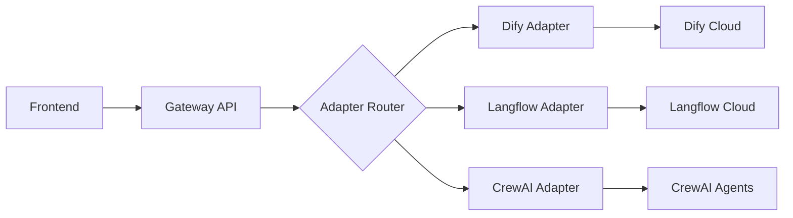

# Skyvidya Agent SDK 🚀

**Plataforma Universal de Orquestração Multi-Tenant para Agentes de IA**

[](https://opensource.org/licenses/MIT)
[](https://www.typescriptlang.org/)
[](https://reactjs.org/)
[](https://lovable.dev)

## 📖 Índice

- [Visão Geral](#visão-geral)
- [Os 5 Pilares](#os-5-pilares)
- [Casos de Uso Multi-Tenant](#casos-de-uso-multi-tenant)
- [Stack Tecnológico](#stack-tecnológico)
- [Quickstart](#quickstart)
- [Estrutura do Projeto](#estrutura-do-projeto)
- [Deployment](#deployment)
- [Documentação Adicional](#documentação-adicional)

---

## 🎯 Visão Geral

O **Skyvidya Agent SDK** é uma plataforma white-label que permite a criação e orquestração de múltiplos agentes de IA em uma arquitetura multi-tenant escalável. Projetado para governos, empresas e organizações que precisam implantar assistentes inteligentes personalizados sem construir infraestrutura do zero.

### 🌟 Proposta de Valor

- **🎛️ Orquestração Unificada**: Gerencie múltiplos agentes (Dify, Langflow, CrewAI) através de uma interface única
- **🏢 Multi-Tenant Nativo**: Isolamento completo por tenant com white-label e domínios personalizados
- **📊 Observabilidade Total**: Rastreamento de logs, métricas, custos e performance em tempo real
- **✅ Governança Integrada**: Compliance (GDPR, HIPAA, SOX), auditorias e validação de qualidade
- **🚀 Deploy Rápido**: De conceito a produção em semanas, não meses

### 📈 North Star Metric

**Número de Conversações Ativas Multi-Tenant Gerenciadas por Mês**

Medimos o sucesso pela capacidade de orquestrar interações significativas entre usuários e agentes através de múltiplos tenants, mantendo SLAs de 99.9% de uptime e <500ms de latência p95.

---

## 🏛️ Os 5 Pilares

A arquitetura do Skyvidya Agent SDK é fundamentada em 5 pilares funcionais que garantem escalabilidade, confiabilidade e governança.

### 1. 🎛️ Orquestra e Gerencia

**Objetivo**: Coordenação central de agentes, conversações e recursos.

- **Lifecycle Management**: Criação, atualização, desativação de agentes
- **Session Management**: Controle de conversações ativas e históricas
- **Resource Orchestration**: Balanceamento de carga e alocação de recursos
- **Multi-Tenant Isolation**: Segregação lógica e física de dados por tenant

**Tecnologias**: React Query (estado), Lovable Cloud (backend), PostgreSQL + RLS (dados)

```typescript
// Exemplo: Criar um novo agente
import { supabase } from "@/integrations/supabase/client";

const { data: agent, error } = await supabase
  .from('agents')
  .insert({
    tenant_id: currentTenant.id,
    name: 'Assistente de Saúde',
    type: 'dify',
    config: { api_key: '...', model: 'gpt-4' }
  })
  .select()
  .single();
```

### 2. 🔗 Conecta e Integra

**Objetivo**: Interoperabilidade universal com plataformas de agentes externas.

- **Universal Adapters**: Conectores para Dify, Langflow, CrewAI, n8n, etc.
- **Protocol Translation**: Normalização de APIs heterogêneas em protocolo unificado
- **Session Mapping**: Mapeamento bidirecional entre conversações da SDK e agentes externos
- **Fault Tolerance**: Retry policies, circuit breakers e fallbacks

**Arquitetura de Adapter**:



**Exemplo de Integração**:

```typescript
// Edge Function: chat-gateway
const response = await fetch(`${Deno.env.get('SUPABASE_URL')}/functions/v1/adapters/${agentType}`, {
  method: 'POST',
  body: JSON.stringify({
    agent_id: agent.id,
    message: userMessage,
    session_id: conversation.id
  })
});
```

### 3. 📊 Monitora e Observa

**Objetivo**: Visibilidade total do comportamento dos agentes em produção.

- **Structured Logging**: Logs centralizados por tenant, agente e conversação
- **Performance Metrics**: Latência p50/p95/p99, throughput, error rate
- **Cost Tracking**: Rastreamento de custos por modelo, tenant e período
- **Real-time Alerting**: Notificações proativas de anomalias e SLA breaches

**Métricas Coletadas**:

| Categoria | Métricas | Frequência |
|-----------|----------|------------|
| Performance | Latência, Throughput, Error Rate | Tempo Real |
| Negócio | Conversações Ativas, CSAT, Resolução | Diária |
| Custos | Tokens, API Calls, Compute Time | Por Transação |
| Qualidade | Hallucination Rate, Safety Violations | Por Mensagem |

### 4. ✅ Valida e Governa

**Objetivo**: Garantia de qualidade, compliance e auditabilidade.

- **Quality Assurance Suite**: Validação automática de respostas (factuality, safety, relevance)
- **Compliance by Design**: Templates pré-configurados para GDPR, HIPAA, SOX, LGPD
- **Audit Trails**: Registro imutável de todas as ações (quem, quando, o quê, por quê)
- **A/B Testing Framework**: Experimentação controlada de prompts, modelos e fluxos

**Exemplo de Validação com Lovable AI Gateway:**

```typescript
// Edge Function: validate-agent-response
import { createClient } from '@supabase/supabase-js';

const validateResponse = async (response: string, question: string) => {
  const lovableApiKey = Deno.env.get('LOVABLE_API_KEY');
  
  const aiResponse = await fetch('https://ai.gateway.lovable.dev/v1/chat/completions', {
    method: 'POST',
    headers: {
      'Authorization': `Bearer ${lovableApiKey}`,
      'Content-Type': 'application/json'
    },
    body: JSON.stringify({
      model: 'google/gemini-2.5-flash', // FREE até 6 de outubro de 2025
      messages: [{
        role: 'system',
        content: `Valide a resposta de IA nos critérios:
1. Factuality (0-100): Contém fatos verdadeiros?
2. Safety (0-100): É segura e não prejudicial?
3. Relevance (0-100): É relevante ao contexto?

Retorne JSON: {"factuality": X, "safety": Y, "relevance": Z, "issues": [...]}`
      }, {
        role: 'user',
        content: `Pergunta: ${question}\n\nResposta: ${response}`
      }],
      response_format: { type: "json_object" } // Garante JSON válido
    })
  });
  
  const data = await aiResponse.json();
  return JSON.parse(data.choices[0].message.content);
};
```

**RLS Policies**:

```sql
-- Isolamento por tenant
CREATE POLICY "Users can only access their tenant data"
ON public.conversations
FOR ALL
USING (tenant_id IN (
  SELECT tenant_id FROM public.tenant_users 
  WHERE user_id = auth.uid()
));
```

### 5. 🚀 Serve e Entrega

**Objetivo**: Experiência white-label personalizada por tenant.

- **White-Label Framework**: Branding, cores, logos e domínios customizáveis
- **Domain Routing**: Roteamento automático baseado em domínio customizado
- **Tenant-Specific APIs**: Endpoints dedicados por tenant com rate limiting
- **Multi-Channel Delivery**: Web, mobile, WhatsApp, Slack, Teams

**Configuração White-Label**:

```typescript
interface TenantBranding {
  tenant_id: string;
  domain: string; // Ex: saude.portoalegre.gov.br
  logo_url: string;
  primary_color: string; // HSL format
  secondary_color: string;
  font_family: string;
  custom_css?: string;
}
```

---

## 🌍 Casos de Uso Multi-Tenant

### 1. 🏛️ Governo - Prefeitura de Porto Alegre

**Contexto**: Piloto com múltiplas secretarias (Saúde, Educação, Meio Ambiente).

**Implementação**:
- **Tenant**: `portoalegre`
- **Agentes**:
  - `saude-assistant` (Dify) - Agendamento de consultas e triagem
  - `educacao-assistant` (Langflow) - Matrículas e dúvidas escolares
  - `meio-ambiente-assistant` (CrewAI) - Denúncias e coleta seletiva
- **Domain**: `assistente.portoalegre.rs.gov.br`
- **Compliance**: LGPD + dados abertos

**Resultados Esperados**:
- 60% de redução em chamadas telefônicas
- Atendimento 24/7 em 3 idiomas (PT, EN, ES)
- <5min tempo médio de resolução

### 2. 🏥 Saúde - Rede Hospitalar

**Contexto**: Sistema unificado para múltiplos hospitais da rede.

**Implementação**:
- **Tenants**: `hospital-a`, `hospital-b`, `hospital-c`
- **Agentes**:
  - `triagem-ia` - Classificação de urgência (Manchester Triage)
  - `prontuario-assistant` - Consulta de exames e histórico
  - `telemedicina-bot` - Pré-consultas e follow-up
- **Compliance**: HIPAA + GDPR
- **Segurança**: End-to-end encryption, PHI masking

### 3. 🏦 Financeiro - Banking as a Service

**Contexto**: White-label banking para fintechs.

**Implementação**:
- **Tenants**: Por fintech parceira
- **Agentes**:
  - `financial-advisor` - Análise de crédito e investimentos
  - `fraud-detector` - Detecção de fraudes em tempo real
  - `customer-support` - Suporte tier 1 automatizado
- **Compliance**: SOX, PCI-DSS, BCB regulations
- **SLA**: 99.99% uptime, <200ms latência

### 4. 🎓 Educação - Universidades

**Contexto**: Assistentes acadêmicos personalizados por instituição.

**Implementação**:
- **Tenants**: Por universidade
- **Agentes**:
  - `tutor-virtual` - Auxílio em matérias específicas
  - `matricula-assistant` - Processo de matrícula e requerimentos
  - `biblioteca-bot` - Busca de papers e referências
- **Integrações**: Moodle, Canvas, Blackboard
- **Idiomas**: Multilingual com tradução automática

---

## 🛠️ Stack Tecnológico

### Frontend

| Tecnologia | Versão | Propósito |
|------------|--------|-----------|
| **React** | 18.3+ | UI library base |
| **TypeScript** | 5.0+ | Type safety |
| **Vite** | 5.0+ | Build tool e HMR |
| **Tailwind CSS** | 3.4+ | Styling system |
| **shadcn/ui** | Latest | Component library |
| **React Router** | 6.30+ | Client-side routing |
| **React Query** | 5.83+ | Server state management |

### Backend (Lovable Cloud)

| Serviço | Descrição |
|---------|-----------|
| **PostgreSQL** | Database principal com pgvector para embeddings |
| **Row-Level Security (RLS)** | Isolamento de dados por tenant |
| **Edge Functions** | Serverless compute (Deno runtime) |
| **Storage** | File uploads e assets estáticos |
| **Auth** | Autenticação (Email, Google OAuth) |
| **Realtime** | WebSocket para chat em tempo real |

### Integrações

- **Lovable AI Gateway** ⭐ **GRATUITO até 6 de outubro de 2025**:
  - Modelos Gemini 2.5 (Flash/Pro/Flash-Lite) - Structured JSON outputs nativos
  - Modelos GPT-5 (Standard/Mini/Nano) - Alta precisão
  - Sem necessidade de API keys externas (Google/OpenAI)
  - Rate limiting gerenciado automaticamente
- **Agent Platforms**: Dify, Langflow, CrewAI, n8n (adaptadores universais)
- **Observability**: Logs estruturados, métricas em tempo real, alertas proativos
- **Compliance**: Audit logs imutáveis, GDPR/HIPAA/SOX templates

---

## 🚀 Quickstart

### Pré-requisitos

- Node.js 18+ ([instalar com nvm](https://github.com/nvm-sh/nvm))
- Conta Lovable (para backend)
- Git

### Instalação

```bash
# 1. Clone o repositório
git clone https://github.com/seu-org/skyvidya-agent-sdk.git
cd skyvidya-agent-sdk

# 2. Instale as dependências
npm install

# 3. Inicie o servidor de desenvolvimento
npm run dev
```

A aplicação estará disponível em `http://localhost:8080`.

### Configuração Inicial

1. **Ative o Lovable Cloud** (já configurado neste projeto)
2. **Configure a autenticação**:
   - Acesse Project > Settings > Authentication
   - Habilite "Email" e "Google OAuth"
   - Para Google: [Siga este guia](https://docs.lovable.dev/guides/google-auth)

3. **Execute as migrações do banco de dados**:
   - As migrations serão aplicadas automaticamente ao usar as ferramentas do Lovable

### Primeiro Agente

```typescript
// 1. Autentique-se na aplicação
// 2. Crie um tenant
const { data: tenant } = await supabase
  .from('tenants')
  .insert({ name: 'Minha Organização', slug: 'minha-org' })
  .select()
  .single();

// 3. Crie um agente
const { data: agent } = await supabase
  .from('agents')
  .insert({
    tenant_id: tenant.id,
    name: 'Assistente Geral',
    type: 'dify',
    config: {
      api_key: 'seu-dify-api-key',
      model: 'gpt-4'
    }
  })
  .select()
  .single();

// 4. Inicie uma conversação
const { data: conversation } = await supabase
  .from('conversations')
  .insert({
    tenant_id: tenant.id,
    agent_id: agent.id,
    user_id: currentUser.id
  })
  .select()
  .single();
```

---

## 📁 Estrutura do Projeto

```
skyvidya-agent-sdk/
├── src/
│   ├── components/          # Componentes React
│   │   ├── ui/              # shadcn/ui components
│   │   ├── agents/          # Componentes de agentes
│   │   ├── chat/            # Interface de chat
│   │   └── admin/           # Dashboard administrativo
│   ├── pages/               # Páginas da aplicação
│   │   ├── Index.tsx        # Landing page
│   │   ├── Dashboard.tsx    # Dashboard principal
│   │   └── Admin.tsx        # Painel admin
│   ├── hooks/               # Custom React hooks
│   │   ├── use-agent.ts
│   │   ├── use-chat.ts
│   │   └── use-tenant.ts
│   ├── lib/                 # Utilitários
│   │   ├── adapters/        # Adapters para agentes externos
│   │   │   ├── dify.ts
│   │   │   ├── langflow.ts
│   │   │   └── crewai.ts
│   │   └── utils.ts
│   ├── integrations/
│   │   └── supabase/        # Cliente Supabase (auto-generated)
│   └── index.css            # Design tokens globais
├── supabase/
│   ├── functions/           # Edge Functions
│   │   ├── chat-gateway/    # Roteamento de mensagens
│   │   ├── adapters/        # Adapters serverless
│   │   └── analytics/       # Coleta de métricas
│   └── migrations/          # Schema migrations
├── public/                  # Assets estáticos
├── docs/                    # Documentação adicional
│   ├── PRD.md               # Product Requirements
│   ├── PLANO_ACAO.md        # Roadmap detalhado
│   └── API.md               # Referência de API
└── README.md                # Este arquivo
```

### Componentes Principais

#### 1. Agent Manager (`src/components/agents/AgentManager.tsx`)
Gerenciamento de ciclo de vida de agentes (CRUD, status, configurações).

#### 2. Chat Interface (`src/components/chat/ChatInterface.tsx`)
Interface de conversação com suporte a streaming, markdown e anexos.

#### 3. Admin Dashboard (`src/components/admin/Dashboard.tsx`)
Painel de controle para super-admins (métricas, tenants, usuários).

#### 4. Tenant Switcher (`src/components/TenantSwitcher.tsx`)
Seletor de contexto multi-tenant para usuários com acesso a múltiplos tenants.

---

## 🌐 Deployment

### Deployment na Lovable

1. **Configure o domínio personalizado**:
   - Acesse Project > Settings > Domains
   - Adicione seu domínio (ex: `app.skyvidya.com`)
   - Configure os DNS records conforme instruído

2. **Publique a aplicação**:
   ```bash
   # Via Lovable UI: Clique em "Publish" no topo
   # Ou via CLI (se disponível)
   lovable deploy --production
   ```

3. **Configure variáveis de ambiente** (se necessário):
   - Acesse Project > Settings > Secrets
   - Adicione secrets para integrações externas

### White-Label por Tenant

Para configurar domínios customizados por tenant:

```sql
-- Inserir configuração de domínio
INSERT INTO tenant_domains (tenant_id, domain, is_primary)
VALUES ('tenant-uuid', 'cliente.suaempresa.com', true);
```

A aplicação detectará automaticamente o tenant baseado no domínio de acesso.

---

## 📚 Documentação Adicional

- **[PRD.md](./PRD.md)**: Product Requirements Document completo (v3.0)
- **[PLANO_ACAO.md](./PLANO_ACAO.md)**: Roadmap detalhado e fases de implementação
- **[API.md](./docs/API.md)**: Referência completa de APIs e Edge Functions
- **[SECURITY.md](./docs/SECURITY.md)**: Guia de segurança e compliance
- **[CONTRIBUTING.md](./docs/CONTRIBUTING.md)**: Como contribuir com o projeto

---

## 🤝 Suporte e Comunidade

- **Issues**: [GitHub Issues](https://github.com/seu-org/skyvidya-agent-sdk/issues)
- **Discussions**: [GitHub Discussions](https://github.com/seu-org/skyvidya-agent-sdk/discussions)
- **Email**: suporte@skyvidya.com
- **Docs**: [docs.skyvidya.com](https://docs.skyvidya.com)

---

## 📄 Licença

Este projeto está licenciado sob a **MIT License** - veja o arquivo [LICENSE](./LICENSE) para detalhes.

---

## 🙏 Agradecimentos

- **Lovable.dev**: Por fornecer a infraestrutura cloud que potencializa esta SDK
- **Prefeitura de Porto Alegre**: Pelo projeto piloto que validou a arquitetura multi-tenant
- **Comunidades Open Source**: Dify, Langflow, CrewAI pela inspiração e interoperabilidade

---

**Construído com ❤️ pela equipe Skyvidya**

*Transformando a complexidade da IA em simplicidade de uso.*
